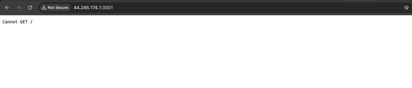
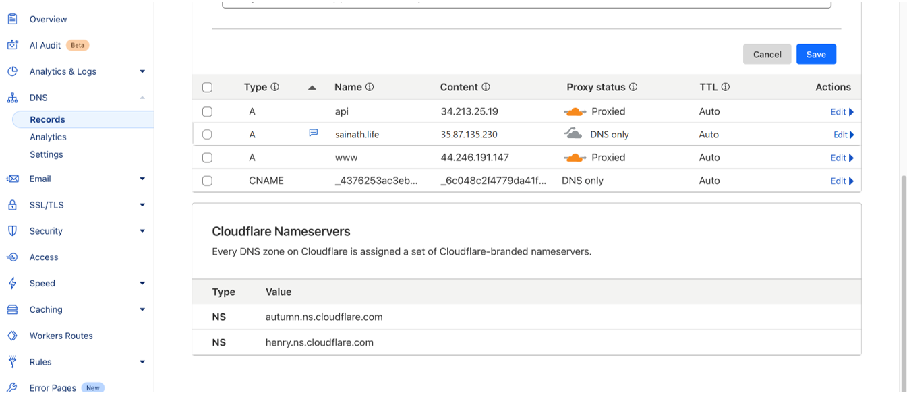

**TravelMemory MERN Stack Deployment on AWS**

## Introduction

This project provides comprehensive documentation for deploying the TravelMemory MERN stack application on AWS EC2 instances. It includes detailed configuration of load balancers, integration with a custom domain using Cloudflare, and secure HTTPS setup through Certbot and Let's Encrypt.

## Project Overview

**TravelMemory** is a MERN stack (MongoDB, Express, React, Node.js) full-stack web application. This document outlines the complete steps to deploy the application to AWS, configure EC2 instances for frontend and backend, use NGINX as a reverse proxy, secure with HTTPS using Let's Encrypt, and configure DNS through GoDaddy and Cloudflare.

---

## 📌 Architecture Overview

The deployment architecture of the **TravelMemory** MERN stack application is designed with scalability, security, and high availability in mind. It leverages a multi-instance setup with load balancing and HTTPS encryption.

### 🔧 Infrastructure Components

- **2 Frontend EC2 Instances**
  - Host the React-based user interface.
  - Serve static files via NGINX.
  
- **2 Backend EC2 Instances**
  - Run the Node.js + Express server.
  - Connect to the MongoDB database.

- **Application Load Balancer (Frontend)**
  - Distributes incoming web traffic across frontend EC2 instances.
  - Ensures high availability and fault tolerance.

- **Application Load Balancer (Backend)**
  - Routes API requests to backend instances.
  - Provides health checks and automatic failover.

- **Cloudflare DNS Configuration**
  - Manages DNS resolution and domain pointing.
  - Enhances security with DDoS protection and DNS caching.

- **NGINX as Reverse Proxy**
  - Configured on all instances to forward traffic to the appropriate services.
  - Improves performance and handles routing logic.

- **Certbot with Let’s Encrypt**
  - Used to enable HTTPS across frontend and backend domains.
  - Automates SSL certificate generation and renewal.

---

This architecture ensures that the **TravelMemory** application is robust, secure, and production-ready with full support for custom domains and encrypted traffic.

## Architecture Diagram


---

## ⚙️ Backend Deployment Steps

1. **Launch an EC2 Instance for the Backend**  
   An EC2 instance was provisioned specifically for the backend services and named:
   - Name: `sainathIslavath-TM-BE-WUS2-01`
   - OS: `Ubuntu 24.04`

   

   

   

   

   

   

   

   ### Connect the instance
   

   

2. **Install Dependencies**
Run the following command to update the package index, install nodejs, npm and nginx and retrieve the latest information about available packages from the repositories: 
   ```bash
   sudo apt update
   sudo apt install nodejs npm nginx -y
   ```
   

   

3. **Clone Repository**
Clone the repository from the github using the below command
   ```bash
   sudo git clone https://github.com/UnpredictablePrashant/TravelMemory.git
   cd TravelMemory/backend
   ```
   

   

   

4. **Set Up Environment File**
Add the environmental file using the below command
   ```bash
   sudo nano .env
   ```
   

   

5. **Install Node Packages & Start**
Install Node.js using the following command, which ensures non-interactive installation by automatically confirming the prompt
   ```bash
   sudo apt install nodejs -y
   pm2 start index.js --name travel-backend
   ```

   

   

   Check the node version installed in the system: node -v 

   

   Install the npm using following command:

   ```bash
   sudo apt install npm -y 
   ```
   

   

   ```bash
   npm -v 
   ```

   

   Install all the node package using the following command
   ```bash
   sudo npm install 
   ```
   

   

   

   ## Follow the same steps for another EC2 Instance and connect it to the ubuntu system

6. **Configure Nginx Reverse Proxy**
## ⚙️ NGINX Configuration and Backend Setup
This section outlines the steps to configure **NGINX** as a reverse proxy for the **TravelMemory** backend and install the necessary Node.js dependencies on your EC2 instance.

---

### Step 1: Enable and Start NGINX

Enable the NGINX service to start on system boot:

```bash
sudo systemctl enable nginx
```
This will synchronize the service state with the system's service manager:
```bash
Synchronizing state of nginx.service with SysV service script with /usr/lib/systemd/systemd-sysv-install.
Executing: /usr/lib/systemd/systemd-sysv-install enable nginx
```
Start the NGINX service:
```bash
sudo systemctl start nginx
```

### step 2: Create NGINX Configuration File
Create a new configuration file for the TravelMemory backend:
```bash
sudo nano /etc/nginx/sites-available/travelmemory
```
In this file, define the server block to proxy HTTP requests to the backend (typically at `localhost:PORT`). 

   ```nginx
   server {
    listen 80;
    server_name api.sainath.life;

    location / {
        proxy_pass http://localhost:3000;
        proxy_http_version 1.1;
        proxy_set_header Host $host;
        proxy_set_header X-Real-IP $remote_addr;
        proxy_set_header X-Forwarded-For $proxy_add_x_forwarded_for;
    }
   }
   server {
    listen 443 ssl;
    server_name api.sainath.life;

    ssl_certificate /etc/letsencrypt/live/api.sainath.life/fullchain.pem;
    ssl_certificate_key /etc/letsencrypt/live/api.sainath.life/privkey.pem;

    location / {
        proxy_pass http://localhost:3000;
        proxy_http_version 1.1;
        proxy_set_header Host $host;
        proxy_set_header X-Real-IP $remote_addr;
        proxy_set_header X-Forwarded-For $proxy_add_x_forwarded_for;
    }
   }
   ```

### Step 3: Enable the Configuration
Create a symbolic link to enable the new configuration:
```bash
sudo ln -s /etc/nginx/sites-available/travelmemory /etc/nginx/sites-enabled/
```

Remove the default NGINX site to avoid conflicts:
```bash
sudo rm /etc/nginx/sites-enabled/default
```
### Step 4: Test and Reload NGINX
Test the NGINX configuration syntax:
```bash
sudo nginx -t
```

Output
```bash
nginx: the configuration file /etc/nginx/nginx.conf syntax is ok
nginx: configuration file /etc/nginx/nginx.conf test is successful
```

Reload NGINX to apply the configuration changes:
```bash
sudo systemctl reload nginx
```
### Step 5: Backend Setup
Navigate to the backend project directory:
```bash
cd ~/TravelMemory/backend
```

Install Node.js project dependencies:
```bash
npm install
```
This installs all required packages listed in package.json to ensure the backend runs correctly.




</br>
   - Front end </br>
   
   ```nginx
   server {
    listen 80;
    server_name kmgtm.info www.kmgtm.info;

    root /home/ubuntu/TravelMemory/frontend/build;
    index index.html;

    location / {
        try_files $uri /index.html;
    }

    error_log /var/log/nginx/frontend_error.log;
    access_log /var/log/nginx/frontend_access.log;
   }
   server {
    listen 443 ssl;
    server_name kmgtm.info www.kmgtm.info;

    ssl_certificate /etc/letsencrypt/live/api.sainath.life/fullchain.pem;
    ssl_certificate_key /etc/letsencrypt/live/api.sainath.life/privkey.pem;
    root /home/ubuntu/TravelMemory/frontend/build;
    index index.html;

    location / {
        try_files $uri /index.html;
    }

    error_log /var/log/nginx/frontend_error.log;
    access_log /var/log/nginx/frontend_access.log;
   }
   ```
Testing backend with custome domain 
Backend running with custom domain 


7. **Enable HTTPS with Certbot**
   ```bash
   sudo apt install certbot python3-certbot-nginx -y
   sudo certbot --nginx -d api.sainath.info
   ```

---
## cloudflare Config 


## 🎨 Frontend Deployment Steps

1. **Launch EC2 Instance**  
   - Name: `sainathIslavath-TM-FE-WUS2-01`
   

   

   

   

   

2. **Clone and Build Frontend**
   ```bash
   git clone https://github.com/UnpredictablePrashant/TravelMemory.git
   cd TravelMemory/frontend
   npm install
   npm run build
   ```

3. **Serve React Build**
   ```bash
   sudo cp -r build/* /var/www/html/
   sudo nano /etc/nginx/sites-available/default
   sudo systemctl restart nginx
   ```
   

4. **Enabled HTTPS with Certbot**
   ```bash
   sudo apt install certbot python3-certbot-nginx -y
   sudo certbot --nginx -d <frontend-domain>
   ```

---

## Frontend Deployment on EC2 with NGINX and Custom Domain
This section details the steps to deploy the React frontend of the TravelMemory application on an EC2 instance, assign a custom domain, and configure HTTPS using Certbot.


## 🌐 Frontend Deployment Instructions

This section outlines how to deploy the **TravelMemory** React frontend on an AWS EC2 instance, configure it with NGINX, map it to a custom domain, and enable HTTPS using Certbot.

---

### 1. Application Served via IP and Custom Domain

The frontend application is hosted on the EC2 public IP:

`http://44.246.191.147`


This IP is mapped to a **custom domain** through DNS configuration (via Cloudflare/GoDaddy).

---

### 2. Install Static File Server (Optional for Local Testing)

To preview the production build locally using a static file server:

```bash
npm install -g serve
serve -s build
```

### 3. Copy Build Files to NGINX Root Directory
Once the build is complete, copy the build files to NGINX's default web root:

```bash
sudo cp -r build/* /var/www/html/
```
This allows NGINX to serve your React application directly from `/var/www/html/`.

### 4. Configure NGINX Default Site
Open the default site configuration file in a text editor:
```bash
sudo nano /etc/nginx/sites-available/default
```
Update it to include the following block:
```bash
server {
    listen 80;
    server_name www.yourdomain.com;

    root /var/www/html;
    index index.html;

    location / {
        try_files $uri /index.html;
    }
}
```

### 5. Test NGINX Configuration Syntax
Before restarting NGINX, test the configuration:
```bash 
sudo nginx -t
```
output:
```bash
nginx: the configuration file /etc/nginx/nginx.conf syntax is ok
nginx: configuration file /etc/nginx/nginx.conf test is successful
```
### 6. Restart NGINX Service
```bash
sudo systemctl restart nginx
```

### 7. Install Certbot for SSL (HTTPS)
To secure your frontend with HTTPS using Let's Encrypt:
```bash
sudo apt install certbot python3-certbot-nginx -y
```
Certbot will:

    Issue an SSL certificate

    Automatically configure NGINX

    Set up renewal tasks for certificate expiration

To initiate the certificate issuance, run:
```bash
sudo certbot --nginx -d www.yourdomain.com
```


## Backend Setup using image 
Steps to deploy the backend on an EC2 instance.
Clone Backend 


## Frontend Setup using image
Steps to deploy the React frontend application.
Clone front end 


## Creating Target Groups for Frontend and Backend
Creating Backend 02 


Create front end 02 


Target group from FE


## Load Balancer Configuration for Frontend and Backend
How to configure AWS ALBs for both frontend and backend.
Target group for BE


Creating LB FE


## Domain and DNS Setup
Details on GoDaddy and Cloudflare domain configuration.
Created domain in godaddy 
Activate custom Domain in Cloud flare
Now removing the EC2 IPS in Cloudflare 



And Pointing to LB

## HTTPS and SSL
Using Certbot and Let's Encrypt for enabling HTTPS.
Backend running with custom domain 


## SSL Setup Using Certbot (Let’s Encrypt)

This section outlines how to generate and apply an SSL certificate for the backend using **Certbot** on NGINX. The backend is hosted on `https://api.sainath.life`.

---

### Navigating to Backend Directory

```bash
ubuntu@ip-172-31-38-123:~$ ls
TravelMemory

ubuntu@ip-172-31-38-123:~$ cd TravelMemory

ubuntu@ip-172-31-38-123:~/TravelMemory$ ls
LICENSE  README.md  azure-pipelines.yml  backend  frontend

ubuntu@ip-172-31-38-123:~/TravelMemory$ cd backend
```
### Installing Certbot
```bash
sudo certbot --nginx -d api.sainath.life
```

Certbot prompts for email and agreement:
```bash
Enter email address (used for urgent renewal and security notices)
(Enter 'c' to cancel): sainathislavath7@gmail.com

Agree to Terms of Service: Y
Subscribe to EFF newsletter: Y
```

output:
```bash
Successfully received certificate.
Certificate is saved at: /etc/letsencrypt/live/api.sainath.life/fullchain.pem
Key is saved at:         /etc/letsencrypt/live/api.sainath.life/privkey.pem
This certificate expires on 2025-09-12.
Certbot has set up a scheduled task to automatically renew this certificate in the background.

Successfully deployed certificate for api.sainath.life to /etc/nginx/sites-enabled/travelmemory

Congratulations! You have successfully enabled HTTPS on https://api.sainath.life
```

Test and Reload NGINX
```bash
sudo nginx -t
```
```bash
nginx: the configuration file /etc/nginx/nginx.conf syntax is ok
nginx: configuration file /etc/nginx/nginx.conf test is successful
```
```bash
sudo systemctl reload nginx
```

Verifying HTTPS Using cURL
```bash 
curl -v https://api.sainath.life
```

Successful HTTPS negotiation:
```bash
* SSL connection using TLSv1.3 / TLS_AES_256_GCM_SHA384 / X25519
* Server certificate:
*  subject: CN=api.sainath.life
*  start date: Jun 14 05:40:18 2025 GMT
*  expire date: Sep 12 05:40:17 2025 GMT
*  issuer: C=US; O=Let's Encrypt; CN=E6
*  SSL certificate verify ok.
```
Response:
```
< HTTP/1.1 502 Bad Gateway
< Server: nginx/1.24.0 (Ubuntu)
< Date: Sat, 14 Jun 2025 06:39:38 GMT
< Content-Type: text/html
< Content-Length: 166
< 
<html>
<head><title>502 Bad Gateway</title></head>
<body>
<center><h1>502 Bad Gateway</h1></center>
<hr><center>nginx/1.24.0 (Ubuntu)</center>
</body>
</html>
```
Note: A 502 Bad Gateway indicates that NGINX is running and SSL is working, but the backend process (e.g., Node.js server) may not be active or reachable at the expected port.

## Check Backend Runtime Status with PM2
To ensure the backend process is running properly:
```bash
pm2 list
```
output:
```bash
┌────┬──────────┬─────────────┬─────────┬─────────┬──────────┬────────┬──────┬───────────┬──────────┬──────────┬──────────┬──────────┐
│ id │ name     │ namespace   │ version │ mode    │ pid      │ uptime │ ↺    │ status    │ cpu      │ mem      │ user     │ watching │
├────┼──────────┼─────────────┼─────────┼─────────┼──────────┼────────┼──────┼───────────┼──────────┼──────────┼──────────┼──────────┤
│ 0  │ index    │ default     │ 1.0.0   │ fork    │ 3912     │ 25m    │ 1    │ online    │ 0%       │ 81.8mb   │ ubuntu   │ disabled │
│ 1  │ index    │ default     │ 1.0.0   │ fork    │ 18500    │ 0s     │ 1366 │ online    │ 50%      │ 13.4mb   │ ubuntu   │ disabled │
└────┴──────────┴─────────────┴─────────┴─────────┴──────────┴────────┴──────┴───────────┴──────────┴──────────┴──────────┴──────────┘
```

## Explanation of Key Columns:

| Column     | Description                                                                 |
|------------|-----------------------------------------------------------------------------|
| `id`       | Unique PM2 process ID                                                       |
| `name`     | The name of the script being executed (e.g., `index.js`)                    |
| `namespace`| Logical group name (default unless customized)                              |
| `version`  | Version of the Node.js application                                          |
| `mode`     | Running mode (`fork` for single instance, `cluster` for multiple instances) |
| `pid`      | System Process ID of the Node.js process                                    |
| `uptime`   | Duration the process has been running                                       |
| `↺`        | Number of restarts triggered (due to crashes, reloads, etc.)                |
| `status`   | Current process status (e.g., `online`, `stopped`)                          |
| `cpu`      | CPU usage (%)                                                               |
| `mem`      | Memory usage                                                                |
| `user`     | The system user running the process (e.g., `ubuntu`)                        |
| `watching` | Whether PM2 is watching files for changes (used for hot reloading)          |

## 🔐 Finalizing NGINX and SSL Configuration for Backend

This section covers the NGINX backend configuration, resolution of server name conflicts, and final SSL validation for `https://api.sainath.life`.

---

### NGINX Backend Configuration

File: `/etc/nginx/sites-available/travelmemory-backend`

```nginx
server {
    listen 80;
    server_name api.sainath.life;

    location / {
        proxy_pass http://localhost:3000;
        proxy_http_version 1.1;
        proxy_set_header Host $host;
        proxy_set_header X-Real-IP $remote_addr;
        proxy_set_header X-Forwarded-For $proxy_add_x_forwarded_for;
        proxy_set_header Upgrade $http_upgrade;
        proxy_set_header Connection 'upgrade';
    }
}
```

### Resolving NGINX Server Name Conflict
When testing the configuration:
```bash
sudo nginx -t
```

You may encounter this warning:
```bash
[warn] conflicting server name "api.sainath.life" on 0.0.0.0:80, ignored
```

This indicates duplicate server_name entries. To fix this:
1. Check for duplicates:
```bash 
sudo grep -ir 'server_name api.sainath.life' /etc/nginx/sites-available
```

2. Remove duplicates if necessary:
```bash
sudo rm /etc/nginx/sites-enabled/travelmemory
sudo rm /etc/nginx/sites-available/travelmemory
```

3. Reload NGINX:
```bash
sudo nginx -t
sudo systemctl reload nginx
```

4. Final Verification with curl

Check the HTTPS response:
```bash
curl -v https://api.sainath.life
```

Expected successful TLS handshake:
```bash
* SSL connection using TLSv1.3 / TLS_AES_256_GCM_SHA384
* Server certificate:
*  subject: CN=api.sainath.life
*  start date: Jun 14 05:40:18 2025 GMT
*  expire date: Sep 12 05:40:17 2025 GMT
*  issuer: C=US; O=Let's Encrypt
*  SSL certificate verify ok.
```
output after resolving backend service availability:
```bash
< HTTP/1.1 200 OK
< Server: nginx/1.24.0 (Ubuntu)
< Content-Type: text/html; charset=utf-8
< Content-Length: 32
< X-Powered-By: Express
< Access-Control-Allow-Origin: *
< TravelMemory backend is running!
```
## Backend Process Verification (PM2)
Ensure that the backend server (e.g., index.js) is active:
```bash
pm2 list
```
output:
```bash
┌────┬────────┬─────────────┬─────────┬─────────┬─────┬────────┬────┬────────┐
│ id │ name   │ namespace   │ version │ mode    │ pid │ uptime │ ↺  │ status │
├────┼────────┼─────────────┼─────────┼─────────┼─────┼────────┼────┼────────┤
│ 0  │ index  │ default     │ 1.0.0   │ fork    │ 3912│ 25m     │ 1  │ online │
│ 1  │ index  │ default     │ 1.0.0   │ fork    │ 18500│ 0s     │ 1366│ online │
└────┴────────┴─────────────┴─────────┴─────────┴─────┴────────┴────┴────────┘
```


## Testing and Health Checks
Checking load balancer target health and overall availability.
Check the application health of Frontend and Backend Load balancer and target security group


Frontend app health 


Backend App health 


## ✅ Health Check & Testing

- Ensureing my EC2 instances pass health checks in their target groups
- Backend running: `https://api.sainath.life`
- Frontend running: `https://sainath.life` </br>
  
## 🔒 SSL Details

- Issued via Let's Encrypt
- Auto-renewal configured using Certbot
- Cert location:
  ```
  /etc/letsencrypt/live/<domain>/fullchain.pem
  ```

## 🧑‍💻 Author

**Laxmi Sainath Islavath**

---

## Code taken from below Repository

[GitHub - TravelMemory](https://github.com/UnpredictablePrashant/TravelMemory)

## Architecture Diagram

[Architecture Diagram](https://drive.google.com/file/d/1mdZLwEIFgHdPTLYoMKS_ZY0TrBJ_FO3x/view?usp=sharing)